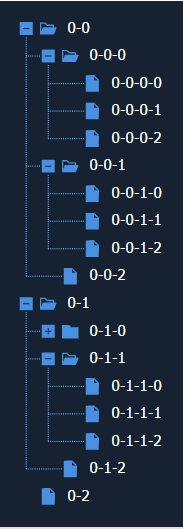

# svg-tree

# install

```
  npm install svg-tree
```
# usage

```
  import Tree from 'svg-tree'

  new Tree({
    container:'tree',
    parameter:{
      node_margin: 5,
      node_height: 20,
      node_field: 'title',
      icon_size: 15,
      icon_margin: 5,
      expand_icon: 'icon-plus-square-fill',
      collapse_icon: 'icon-minus-square-fill',
      directory_open_icon: 'icon-folder-open',
      directory_close_icon: 'icon-folder1',
      leaf_node_icon: 'icon-file',
      node_click(node){}
    },
    data:[]
  })
```
  container:一个可以嵌入svg的容器，可以传入容器id或者DOM元素  

  parameter:构造参数。  

      node_margin: 节点间的上下间距 默认: 5  

      node_height: 节点高度 默认: 20  

      node_field: 节点显示的字段名 默认: 'title'  

      icon_size: 节点图标大小 默认: 15px  

      icon_margin: 图标间隔 默认: 5  

      expand_icon: 展开图标  

      collapse_icon: 收起图标  

      directory_open_icon: 目录展开时的图标  

      directory_close_icon: 目录收起时的图标  

      leaf_node_icon: 叶子节点图标  

      node_click: 节点点击事件 参数为(node,index) node点击的节点数据,index父级目录下的下标  

  data:要展示的数据。子节点取children属性  
  
# effect
  